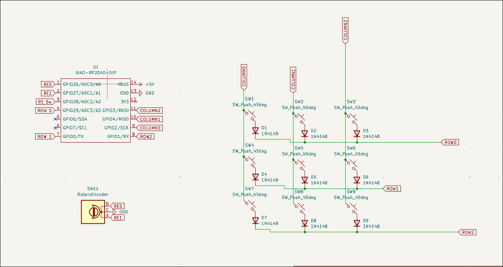
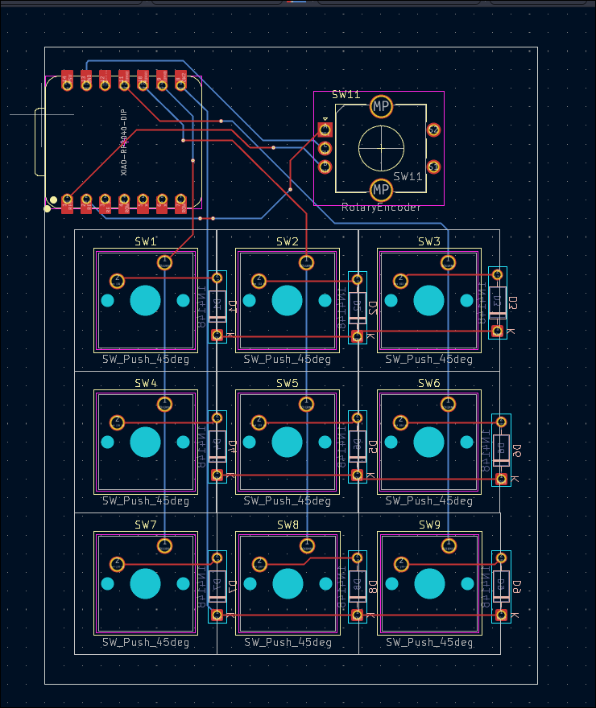

# Harry-Pad

### Why did I make it?
As I dont have a keyboard I work on my laptop's keyboard so I can assign specific keys for specific functions i.e. Opening Spotify, Copy paste shortcuts, Screenshot shortcuts etc.

### What was the hardest part about this ?
The hardest part was probably the firmware as I didnt know any coding language so it was pretty challenging

### Bill of Materials
 - 1x Seeed XIAO RP2040
 - 9x SW_Cherry_MX_1.00u_PCB
 - 9x Blank DSA keycaps (Either White or Red)
 - Case (Navy Blue or gray)
 - 1x RE

### Schematic

---

### PCB 

---

### Case
- Bottom

- Top

## Assembly

